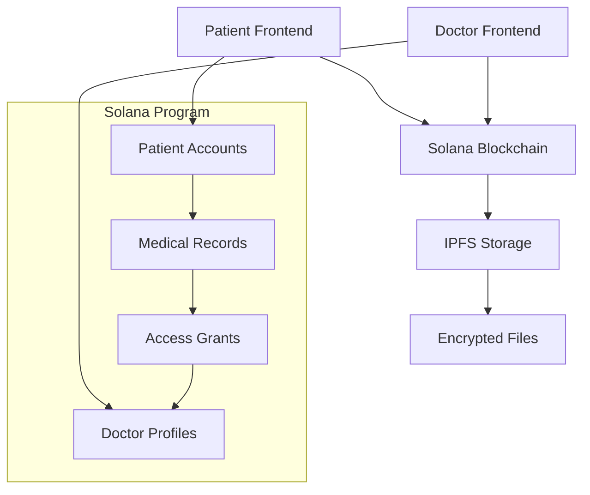

# 🏥 MedChain - Decentralized Medical Records System

[](https://solana.com)
[](https://www.anchor-lang.com)
[](https://vuejs.org)
[](https://www.typescriptlang.org)
[](https://ipfs.io)

> **Empowering Patients, Securing Health Data**  
> A blockchain-based medical records system that puts patients in control of their health data while enabling secure sharing with healthcare providers.

## 🌟 Featured In
*This project demonstrates advanced blockchain development skills and would be an impressive addition to any portfolio or job application.*

## 🚀 Why MedChain?

### The Problem
- 🔒 Medical data is siloed in hospital systems
- 🚫 Patients have limited control over their own health records
- 🔓 Data breaches expose sensitive health information
- ⏳ Sharing records between providers is slow and inefficient

### Our Solution
- ✅ **Patient-Controlled**: You own your data, you control access
- 🔐 **End-to-End Encrypted**: Military-grade encryption for all records
- ⚡ **Instant Sharing**: Securely share records with doctors in seconds
- 📊 **Complete Audit Trail**: See exactly who accessed your data and when
- 🌐 **Interoperable**: Works across healthcare providers

## 🏗️ System Architecture



## 🛠️ Tech Stack

### Blockchain Layer
- **Solana**: High-performance blockchain for medical record metadata
- **Anchor Framework**: Secure Solana program development in Rust
- **PDAs (Program Derived Addresses)**: Deterministic account addressing

### Frontend Layer
- **Vue 3**: Modern, reactive frontend framework
- **TypeScript**: Type-safe development experience
- **Tailwind CSS**: Utility-first CSS framework
- **Solana Wallet Adapter**: Secure wallet integration

### Storage Layer
- **IPFS (Helia)**: Decentralized file storage for medical files
- **Client-Side Encryption**: Files encrypted before IPFS upload

### Security Layer
- **End-to-End Encryption**: AES-256 for files, RSA for key exchange
- **Key Rotation**: Patients can rotate encryption keys
- **Time-Based Access**: Automatic access expiration
- **Revocable Grants**: Instant access revocation

## 📁 Project Structure

```
medchain/
├── programs/medchain/          # Solana Anchor program
│   ├── src/
│   │   ├── lib.rs             # Main program entry
│   │   ├── instructions/      # Program instructions
│   │   ├── states/            # Account structures
│   │   └── errors.rs          # Custom errors
├── app/                       # Vue 3 frontend
│   ├── src/
│   │   ├── components/        # Vue components
│   │   ├── composables/       # Vue composables
│   │   ├── solana/           # Solana configuration
│   │   └── services/         # IPFS and other services
├── tests/                     # Anchor tests
└── migrations/               # Deployment scripts
```

## 🎯 Key Features

### For Patients
- 🏠 **Personal Medical Vault**: Secure storage for all medical records
- 👥 **Granular Access Control**: Share specific records with specific doctors
- ⏰ **Time-Limited Access**: Set expiration dates for shared records
- 🔄 **Key Rotation**: Re-encrypt data and update access selectively
- 📱 **Easy Management**: Simple interface for complex security operations

### For Doctors
- 🔍 **Secure Record Access**: View patient records with proper authorization
- 📋 **Professional Profiles**: Establish verified medical identities
- ⚡ **Quick Access**: Instant access to patient records when granted
- 🔒 **Compliance Ready**: Built-in audit trails and access logs

### Security Features
- 🔐 **End-to-End Encryption**: Only authorized parties can decrypt data
- 🔑 **Key Versioning**: Track and manage encryption key changes
- 🕒 **Automatic Expiration**: Access grants expire automatically
- 🚫 **Instant Revocation**: Patients can revoke access immediately
- 📊 **Complete Audit Trail**: Every access is logged and verifiable

## 🚀 Getting Started

### Prerequisites
- Node.js 18+
- Rust and Cargo
- Solana CLI
- Anchor CLI

### Installation

1. **Clone the repository**
   ```bash
   git clone https://github.com/your-username/medchain.git
   cd medchain
   ```

2. **Install dependencies**
   ```bash
   # Install Anchor
   cargo install --git https://github.com/coral-xyz/anchor anchor-cli --locked

   # Install frontend dependencies
   cd app && npm install
   ```

3. **Build and deploy**
   ```bash
   # Build the Solana program
   anchor build

   # Deploy to local validator
   anchor deploy

   # Start the frontend
   npm run dev
   ```

### Running the Demo

1. **Start local Solana validator**
   ```bash
   solana-test-validator
   ```

2. **Deploy the program**
   ```bash
   anchor deploy
   ```

3. **Run tests**
   ```bash
   anchor test
   ```

4. **Start the frontend**
   ```bash
   cd app && npm run dev
   ```

## 💡 How It Works

### 1. Patient Onboarding
```typescript
// Patients create their medical identity
await initializePatient("John Doe");
```

### 2. Record Upload
```typescript
// Encrypt and store medical records
const record = await uploadMedicalRecord(
  file, 
  "lab_report", 
  "Blood test results"
);
```

### 3. Grant Access
```typescript
// Share with specific doctors
await grantAccess(
  recordId, 
  doctorWallet, 
  30, // 30 days access
  encryptedKeyForDoctor
);
```

### 4. Secure Access
```typescript
// Doctors access records with proper authorization
const records = await getAccessibleRecords();
```

## 🔐 Security Model

### Encryption Flow
```
Patient Data → Generate Symmetric Key → Encrypt File → Upload to IPFS
     ↓
Encrypt Key with Patient's Public Key → Store on Solana
     ↓
Grant Access → Re-encrypt Key with Doctor's Public Key → Store in Access Grant
```

### Key Features
- **Patient Control**: Only patients can grant/revoke access
- **Forward Secrecy**: Key rotation prevents historical access
- **Selective Sharing**: Share specific records with specific doctors
- **Audit Trail**: All access attempts are logged on-chain

## 🧪 Testing

Run the comprehensive test suite:

```bash
# Run all tests
anchor test

# Test specific components
anchor test patient
anchor test doctor
anchor test security
```

## 🌐 Deployment

### Local Development
```bash
solana-test-validator
anchor deploy
npm run dev
```

### DevNet Deployment
```bash
solana config set --url devnet
anchor deploy --provider.cluster devnet
```

### Mainnet Deployment
*Coming soon after security audits*

## 👥 Team

This project was developed as a portfolio piece to demonstrate:
- Advanced Solana and Anchor development
- Secure blockchain application design
- Full-stack development with Vue and TypeScript
- Cryptographic security implementation
- Decentralized storage integration

## 🤝 Contributing

We welcome contributions! Please see our [Contributing Guide](CONTRIBUTING.md) for details.

1. Fork the repository
2. Create a feature branch (`git checkout -b feature/amazing-feature`)
3. Commit your changes (`git commit -m 'Add amazing feature'`)
4. Push to the branch (`git push origin feature/amazing-feature`)
5. Open a Pull Request

## 📄 License

This project is licensed under the MIT License - see the [LICENSE](LICENSE) file for details.

## 🛡️ Security

**Important**: This is a demonstration project. For production medical systems, additional security audits and compliance with healthcare regulations (HIPAA, GDPR) are required.

### Security Considerations
- 🔒 All medical data is encrypted client-side
- 🔑 Private keys never leave the user's wallet
- 📊 Access patterns are logged on-chain
- 🕒 Automatic access expiration
- 🚫 Instant revocation capabilities

## 🎯 Future Enhancements

- [ ] HIPAA compliance certification
- [ ] Integration with EHR systems
- [ ] Mobile applications
- [ ] Emergency access features
- [ ] Insurance provider integration
- [ ] Telemedicine features
- [ ] AI-powered health insights

## 📞 Support

If you have any questions or need help with setup:
- Open an [Issue](https://github.com/Lazizjon-web-dev/medchain/issues)

## ⭐ Show Your Support

If you find this project useful, please give it a star! ⭐

---

**Built with ❤️ for the future of healthcare privacy and patient empowerment.**

*Disclaimer: This is a portfolio project and not intended for production medical use without proper security audits and compliance verification.*